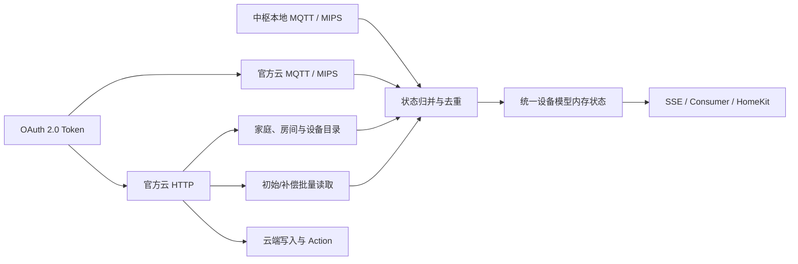

# 小米官方云 MQTT/MIPS 实时状态改造方案

状态：代码与自动化测试已完成；仅剩实体设备验收
作用范围：`xiaomi` 小米中枢网关 Provider 及其复用的 OAuth 官方云路径  
不包含：`xiaomi-miot-cloud` 第三方兼容 Provider

## 1. 改造目标

当前 `xiaomi` Provider 已具备中枢局域网 MQTT/MIPS，以及小米官方云 HTTP 设备目录、属性读取、属性写入和 Action 能力；但官方云设备状态仍以定时 `prop/get` 为主要来源。目标是补充小米官方云 MQTT/MIPS 长连接，使云端属性变化、设备事件和在线状态以推送为主，HTTP 只承担以下职责：

1. 获取家庭、房间和设备目录；
2. Provider 启动后的初始属性批量读取；
3. 属性写入和 Action；
4. MQTT 重连后的状态对账；
5. 不支持通知的属性、状态过期或推送异常时的低频补偿读取。

最终不再把官方云设备描述为“固定周期云端轮询”，而是“云 MQTT 实时推送，HTTP 初始化/控制/补偿”。

## 2. Provider 边界

三种小米接入保持明确区分：

| Provider | 状态来源 | 控制路径 | 本方案处理 |
| --- | --- | --- | --- |
| `xiaomi` | 中枢本地 MQTT + 官方云 MQTT | 本地 MQTT 优先，官方云 HTTP 回退 | 是 |
| `xiaomi-miot-cloud` | 第三方兼容 API、LAN MIoT 和云轮询 | LAN MIoT 优先，第三方云 HTTP 回退 | 否，继续轮询 |
| `xiaomi-home-cloud` | 独立官方纯云 Provider | 预留 | 否，不在本次注册 |

官方云 MQTT 必须由现有 `xiaomi` Provider 持有，不能为了云推送创建第二个 Provider。一个运行实例同时管理：

- 一个中枢局域网 MQTT/MIPS 客户端；
- 一个官方云 MQTT/MIPS 客户端；
- 一个官方云 HTTP 客户端；
- 一份按 DID 合并的设备目录、路由表和内存状态。

只配置了中枢但没有完整 OAuth Token 时，本地链路仍可独立运行；OAuth 完整时自动启用官方云 MQTT，不增加用户必须填写的 Broker 地址、用户名或密码。

## 3. 目标数据流



## 4. 云 MQTT 客户端

### 4.1 连接参数

新增独立的 `cloudMIPSClient` 接口和实现，连接参数从已保存的 OAuth 配置推导：

- Broker：`{region}-ha.mqtt.io.mi.com:8883`；
- Client ID：`ha.{oauthUuid}`；
- Username：OAuth Client ID；
- Password：当前 Access Token；
- MQTT：V5、TLS、合理的 Keep Alive 和自动重连；
- TLS：使用系统受信 CA，完整验证证书链、有效期、ServerAuth 和 DNS SAN；不能复用中枢局域网“不验证 SAN”的专用策略。

Broker 和主题属于协议内部参数，不进入 YAML，也不要求用户在页面填写。Access Token 继续由现有 PostgreSQL 敏感字段加密机制保存。

### 4.2 订阅主题

只为当前 Provider 已配置的设备维护订阅：

```text
device/{did}/up/properties_changed/#
device/{did}/up/event_occured/#
device/{did}/state/#
```

需要保留协议中的 `event_occured` 拼写。订阅管理应满足：

- 初次连接后批量订阅；
- 自动重连后恢复全部期望订阅；
- 添加、移除子设备或修改映射时增量替换订阅，不重建 MQTT 客户端；
- Token 更新时先热更新认证材料；只有 Broker 要求重新认证时才重连现有客户端；
- 相同 OAuth UUID 在一个 Provider 生命周期内最多存在一条云 MQTT 连接。

### 4.3 消息解析

分别建立强类型解析器：

- 属性变化：校验 DID、SIID、PIID、值和时间戳，再复用现有 MIoT 值转换；
- 事件：校验 DID、SIID、EIID 和 arguments，进入 Provider 事件通道，不能伪装成普通属性；
- 在线状态：转换为 online/offline；对云端不发布在线状态的 BLE、Proxy 子设备保留 unknown/stale 语义；
- 无效 JSON、缺字段、未知 DID、未知属性和类型不匹配分别计数，不能使 MQTT 回调线程崩溃。

## 5. 初始读取与补偿刷新

### 5.1 初始状态

Provider 启动顺序调整为：

1. 建立中枢 MQTT；
2. 读取并合并中枢与官方云目录；
3. 加载 MIoT Spec 和设备映射；
4. 建立官方云 MQTT 并确认订阅；
5. 通过 HTTP 对所有可读属性执行一次批量读取；
6. 将初始快照一次性提交到设备状态层；
7. 进入事件驱动运行状态。

订阅先于初始读取完成，避免“读取完成到订阅成功”之间丢失属性变化。若订阅期间收到更新，按观察时间/接收顺序阻止稍旧的初始化响应覆盖新推送。

### 5.2 HTTP 批量读取

当前逐属性调用必须改为按设备和服务整理后分批调用 `prop/get`：

- 批大小使用内部常量并允许后续根据实机响应调整；
- 每批有独立超时，不能让所有设备共享一个默认 10 秒 Context；
- 并发数有界；
- 单项失败只影响对应属性；
- 每台设备一轮读取完成后合并为一个快照和一次广播，避免 N 个属性产生 N 次完整设备事件。

### 5.3 补偿条件

正常云设备不再按 60 秒全量轮询。仅在以下条件读取：

- 云 MQTT 首次连接完成；
- 云 MQTT 断线重连成功，需要弥补消息缺口；
- 某属性的 MIoT Spec 不包含 `notify`；
- 属性超过动态 TTL 仍未收到推送；
- 在线恢复后需要重新校准；
- 用户在设备详情中主动点击“从 Provider 读取”。

对没有 `notify` 的持续状态属性保留低频周期读取。补偿调度以属性为单位，不能因为设备的某个属性可推送就停止刷新该设备全部不可推送属性。

## 6. 本地与云端状态归并

### 6.1 路由语义

- `local`：状态和控制只使用中枢 MQTT；官方云目录可提供名称/房间，但不参与设备状态和控制；
- `cloud`：状态使用官方云 MQTT，初始化和补偿使用官方云 HTTP，控制使用官方云 HTTP；
- `auto`：同时接收中枢和云推送；控制仍本地优先，失败后转官方云 HTTP。

### 6.2 优先级与去重

为每个 `DID/SIID/PIID` 保存最近观察元数据：

- 来源：`local-mqtt`、`cloud-mqtt`、`cloud-http`；
- Provider 本地 sequence；
- 设备/云消息时间戳（存在时）；
- 接收时间；
- 值摘要。

应用规则：

1. 新时间戳覆盖旧时间戳；
2. 时间戳相同或缺失时，本地 MQTT 优先于云 MQTT，推送优先于 HTTP 响应；
3. 相同值的重复消息只更新时间，不重复广播完整设备快照；
4. 较旧 HTTP 响应不能覆盖初始化期间收到的 MQTT 推送；
5. 手工映射和 Profile 转换继续在统一映射层执行，不在传输层复制一套规则。

### 6.3 在线状态

- 明确在线/离线推送立即更新设备可用性并广播；
- 属性读取成功可以把 unknown/offline 恢复为 online；
- 单次读取失败只标记对应属性 unavailable；
- 连续失败、MQTT 断开且超过宽限期后，设备转为 unknown 或 offline；
- 目录中的 `isOnline` 作为初始化提示，不得永久覆盖更晚的 MQTT 状态；
- Provider 关闭时所有所属设备统一离线。

## 7. TTL 与状态来源

新增明确的状态采集来源，避免云推送和云轮询都显示为 `reported`：

| 传输 | 状态 source | 运行标签 |
| --- | --- | --- |
| 中枢 MQTT 推送 | `reported` | 中枢实时 |
| 官方云 MQTT 推送 | `reported` | 官方云实时 |
| 官方云 HTTP 初始化/补偿 | `polled` | 官方云校准 |
| 写入后的临时值 | `optimistic` | 等待确认 |

设备运行信息增加可选 `stateTransport`，建议值为 `local-mqtt`、`cloud-mqtt`、`cloud-http`、`pending`。保留现有 `runtimeMode=local/cloud/pending` 作为粗粒度兼容字段。

TTL 必须按属性策略动态计算：

- 可推送属性：使用较长推送宽限期；
- 不可推送属性：至少大于补偿周期的两倍；
- 自定义模型显式配置的 `staleAfterSeconds` 优先；
- 修改补偿周期后即时重算，不能继续固定为 120 秒。

## 8. 生命周期与线程通信

所有 MQTT 回调只负责解析并投递到有界队列，不能在回调线程内调用 HTTP、数据库或复杂映射逻辑。Provider 内增加单一状态归并协程：

```text
本地 MQTT callback ─┐
云 MQTT callback ───┼─> bounded event queue -> merge worker -> broadcast
HTTP read workers ──┘
```

要求：

- 队列满时记录丢弃指标，并为受影响设备安排一次 HTTP 对账；
- Close 顺序为停止接收、取消 Context、关闭两条 MQTT、等待 Worker、最后标记设备离线；
- `Initialize` 幂等；
- 设备映射热更新只替换设备目录、映射和订阅；
- 中枢地址/证书变化只重连本地 MQTT；
- OAuth 身份或区域变化才替换云 MQTT；
- Access Token 刷新尽量热更新，失败时重连同一个云客户端；
- 不允许旧连接在替换完成后继续向新 Provider 发布事件。

## 9. 设备目录刷新

- 处理中枢 `master/appMsg/devListChange`，防抖后复用当前连接重新读取中枢目录；
- 云 MQTT 若提供设备目录变化消息，则触发官方云 HTTP 目录刷新；否则保留低频目录校准；
- 目录刷新只更新家庭、房间、型号、在线提示和路由能力，不自动导入未配置设备；
- 已配置设备暂时不在目录中时保留配置和最后状态，但标记目录缺失；
- 目录变化和属性变化使用不同队列任务，避免目录 HTTP 请求阻塞状态推送。

## 10. 指标与诊断

Provider 指标新增：

- `cloudMqttConnected`；
- `cloudMqttMessagesReceived`；
- `cloudMqttMessagesInvalid`；
- `cloudMqttMessagesDropped`；
- `cloudMqttReconnects`；
- `cloudMqttSubscriptionFailures`；
- `cloudMqttDuplicateMessages`；
- `cloudHttpInitialReads`；
- `cloudHttpReconcileReads`；
- `cloudHttpReadFailures`；
- `directoryRefreshes`；
- `directoryRefreshFailures`。

Provider 卡片展示两个独立通道：

- 中枢 MQTT：已连接/重连中/不可用；
- 官方云 MQTT：已连接/重连中/未配置；

设备卡片展示实际状态来源，例如“中枢实时”“官方云实时”“官方云校准”，不再把所有 `runtimeMode=cloud` 都翻译为“云端轮询”。

## 11. 配置与数据库

本次不新增 YAML 配置，也不保存当前设备状态。OAuth、Provider 和设备映射继续存入 PostgreSQL，运行状态继续只驻留内存。

原则上不需要新增用户必填字段。若需要保存开关或兼容参数，只能加入 Provider 的数据库 JSON 配置，例如：

```json
{
  "officialCloudPushEnabled": true,
  "cloudReconcileIntervalSeconds": 900
}
```

默认应开启官方云推送。Broker Host、Port、MQTT Client ID、Username 和 Password 均由地区与 OAuth 身份推导，不提供任意输入框，避免误配置和凭据泄露。

## 12. 前端修改

### Provider 页面

- 将“小米中枢：MQTT 本地优先 / OAuth 官方云回退”扩展为本地 MQTT、官方云 MQTT、官方云 HTTP 三通道状态；
- `pollIntervalSeconds` 改名为“状态补偿间隔”，说明它不是云端主状态源；
- 官方云 MQTT 未连接时展示原因、重试时间和最近成功时间；
- Token、Broker 密码和订阅原文不返回前端。

### 子设备页面

- 能力标签改为“中枢实时”“官方云实时”“官方云控制”“需要 HTTP 补偿”；
- `auto/local/cloud` 仍为设备级配置；
- 展示最近状态来源和最近推送时间；
- 对不具备 notify 的属性给出“低频补偿读取”提示。

### 设备中心

- 运行模式翻译支持 `stateTransport`；
- 详情页属性状态显示 `reported/polled/optimistic` 的准确来源；
- 页面顶层“刷新”继续只刷新内存视图；主动访问 Provider 的操作仍使用明确的“从 Provider 读取”。

## 13. 测试计划

所有代码改动必须同步增加单元测试，构建缓存继续通过 `scripts/dev-env.sh` 放在项目目录。

### 云 MQTT 客户端测试

- OAuth 参数正确推导 Broker、Client ID、Username 和 Password；
- 云 TLS 验证 DNS SAN，且不使用中枢的无 SAN 校验策略；
- 属性、事件、在线状态主题解析；
- 无效 Payload 不崩溃并增加错误计数；
- 自动重连和恢复订阅；
- Token 热更新与认证失败重连；
- 增删设备时增量订阅且不建立第二条连接。

### Provider 测试

- 初始化先订阅、后批量读取；
- 初始化响应不能覆盖更新的 MQTT 推送；
- `local/cloud/auto` 状态来源和控制路径正确；
- 本地与云端重复推送去重；
- 本地更新优先于同时间的云端更新；
- 云 MQTT 断线时仅受影响的设备进入宽限/补偿；
- 重连后只执行一次批量对账；
- 不可通知属性继续补偿，可通知属性不做固定全量轮询；
- 读取失败更新属性可用性，连续失败更新设备可用性；
- 目录变化触发防抖刷新但不自动导入设备；
- 热更新映射不重复创建本地或云 MQTT 连接；
- Close 不泄漏 Goroutine，旧客户端不再发布事件。

### 应用层和前端测试

- 云 MQTT 快照经过 Provider → 统一模型映射后只展示已映射属性；
- `polled` 与 `reported` 状态来源正确进入状态仓库；
- SSE、Consumer 和 HomeKit 收到一次合并后的设备更新；
- Provider 卡片显示两条 MQTT 通道；
- 设备卡片正确显示中枢实时、官方云实时和官方云校准；
- 补偿间隔字段和说明不再暗示固定云轮询。

### 验证命令

```sh
./scripts/dev-env.sh sh -c 'cd backend && go test ./... && go vet ./...'
./scripts/dev-env.sh sh -c 'cd backend && go test -race ./internal/providers/xiaomi ./internal/application ./internal/runtime/providermanager'
./scripts/dev-env.sh sh -c 'cd frontend && npm test -- --run && npm run lint && npm run build'
```

## 14. 分阶段实施

### 阶段 A：云 MQTT 基础连接

- [x] 建立接口、配置推导、严格 DNS TLS、MQTT v5 连接、自动重连和订阅管理；
- [x] 接入 Token 热更新，后续认证握手读取最新 Access Token；
- [x] 完成协议解析、订阅集合、Token 与 Provider 生命周期测试；
- [x] 热更新设备集合时增量替换订阅，不创建第二条云连接；
- [x] 使用进程内 Mochi MQTT Broker 完成 MQTT v5 握手、订阅、消息投递、增量换订阅、断线重连、订阅拒绝重试，以及旧 Token 认证失败后热更新恢复测试。

退出条件：长连接可稳定恢复，添加设备不会产生第二条连接，Token 更新后可继续收消息。

### 阶段 B：实时属性、事件和在线状态

- [x] 属性推送进入有界状态归并队列；
- [x] 强类型解析 Event 和设备在线状态，在线状态进入设备可用性；
- [x] 增加来源、时间戳、优先级和重复值去重；
- [x] 初始化 HTTP 响应不能覆盖读取期间到达的较新 MQTT 推送；
- [x] 为瞬时 Event 增加独立 Provider、运行时管理器、应用服务和 SSE 投递通道；使用 `device-event` 事件类型，不伪装成属性或设备快照。

退出条件：云设备状态可由 MQTT 实时更新，重复消息不会产生重复设备广播。

### 阶段 C：批量读取与自适应补偿

- [x] 官方云初始属性改为按设备分批 HTTP 读取，每批独立超时，每台设备一次快照广播；
- [x] 云 MQTT 重连后执行一次批量对账；
- [x] 健康云 MQTT 下只周期补偿不支持 `notify` 的属性；
- [x] 移除健康官方云连接下的固定全属性轮询；
- [x] 增加属性读取失败指数退避、云 MQTT 断线宽限和重连取消机制；断线超过宽限后仅把依赖云路由的设备转为 `unknown/pending`；
- [x] 根据通知能力和补偿间隔计算动态 TTL；可推送属性使用较长宽限，不可推送属性至少覆盖两轮补偿。
- [x] 接入统一模型显式 `staleAfterSeconds` 覆盖、负值校验与连续失败退避。

退出条件：健康云 MQTT 下不再固定轮询全部属性；断线、漏消息和不可通知属性仍可恢复。

### 阶段 D：页面、指标和实机验收

- [x] 设备中心与 Provider 设备列表显示“中枢实时 / 官方云实时 / 官方云校准”；
- [x] Provider 卡片展示官方云 MQTT 连接状态和推送计数；
- [x] 子设备页展示官方云实时或 HTTP 补偿能力；
- [x] 补偿间隔文案不再描述为固定轮询；
- [x] 完成官方云 MQTT 断线原因、预计重试时间、最近连接/断线时间和状态指标；中枢 MQTT 继续由 Provider 运行状态表示；
- [ ] 中国大陆账号、中枢可控设备、仅云 Wi-Fi 设备和事件型设备分别实测；
- [ ] 验证 Token 刷新、网络中断、中枢重启和服务重启。

退出条件：页面能解释每台设备的真实状态路径，持续运行无重复连接、无明显漏事件、无高频云轮询。

## 15. 预计修改文件

后端主要涉及：

- `backend/internal/providers/xiaomi/cloud_mips_client.go`：新增云 MQTT 客户端（避免 `_mips.go` 被 Go 识别为 MIPS 架构文件）；
- `backend/internal/providers/xiaomi/cloud_mips_client_test.go`：协议和生命周期测试；
- `backend/internal/providers/xiaomi/provider.go`：统一生命周期、状态归并和补偿调度；
- `backend/internal/providers/xiaomi/home_cloud.go`：批量初始/补偿读取；
- `backend/internal/providers/xiaomi/credentials.go`：Token 热更新联动；
- `backend/internal/providers/xiaomi/hub_devices.go`：目录变化和推送能力语义；
- `backend/internal/domain/device/device.go`：可选状态传输字段；
- `backend/internal/application/device_service.go`：准确的 `reported/polled` 来源；
- `backend/internal/platform/httpapi/server.go` 与 `docs/openapi.yaml`：运行状态 API。

前端主要涉及：

- `frontend/src/types/device.ts`；
- `frontend/src/types/provider.ts`；
- `frontend/src/components/ProviderCard.tsx`；
- `frontend/src/components/ProviderForm.tsx`；
- `frontend/src/components/XiaomiDeviceManager.tsx`；
- 对应组件测试。

## 16. 验收标准

- 官方云可推送属性在设备变化后无需等待轮询即可进入设备中心和 Consumer；
- 事件不会被丢弃或错误转换成属性；
- 云在线/离线推送能改变设备可用性；
- 正常运行时官方云不再固定全量轮询；
- MQTT 重连后状态能自动对账；
- 不支持 notify 的属性仍能按策略刷新；
- 一个 `xiaomi` Provider 始终只有一条本地 MQTT 和一条官方云 MQTT；
- 添加或修改子设备映射不重复登录、不重建 Provider；
- `auto` 本地优先，云端补充，旧消息不会覆盖新状态；
- 第三方 `xiaomi-miot-cloud` 行为不受影响；
- 全量后端、Race、前端测试通过，并完成至少一轮实体设备持续运行验收。

## 17. 授权与实现约束

本方案依据公开协议行为和官方文档进行独立实现，不复制受限许可证项目的源代码。使用者仍需提供自己有权使用的 OAuth Client ID，并遵守小米账号、云接口、地区和设备授权要求。实现不得绕过账号验证、地区限制、证书验证或设备权限。

## 18. 参考资料

- [XiaoMi/ha_xiaomi_home：消息收发原理](https://github.com/XiaoMi/ha_xiaomi_home#principle-of-messaging)；
- [XiaoMi/ha_xiaomi_home：MIoT Pub/Sub 客户端](https://github.com/XiaoMi/ha_xiaomi_home/blob/main/custom_components/xiaomi_home/miot/miot_mips.py)；
- [HomeLoom 小米 Provider 现状](./xiaomi-provider.md)；
- [HomeLoom 总实现清单](./implementation-checklist.md)。
